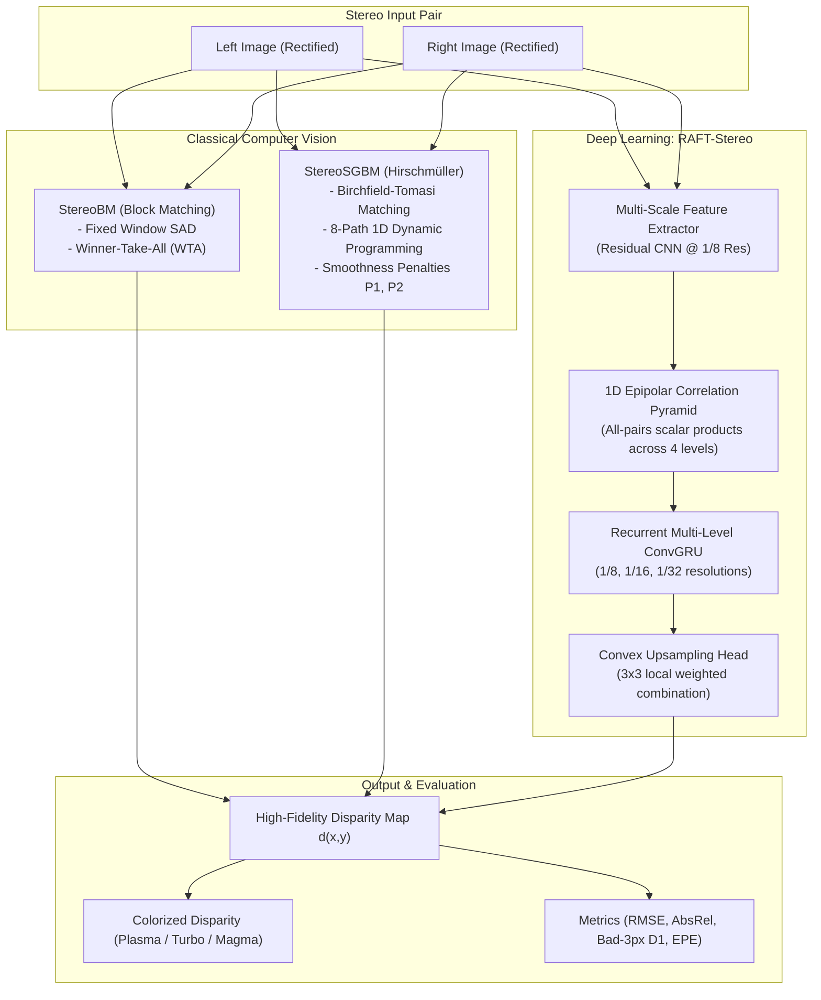
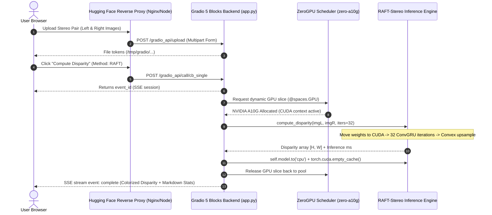

# Stereo Disparity & Relative Depth Estimation
**CO543 / CO5430 Computer Vision — Group G03 (Project ID: P12)**  
*Department of Computer Engineering, University of Peradeniya*  
*Team Members: E/23/127 Herath H.M.K.I. | E/23/188 Kumarasinge K.M.M.Y. | E/23/343 Samarawickrama S.B.N.S. | E/23/347 Sandanayake S.D.M.P.*

---

## 1. Mathematical Formulation & Problem Definition
Stereo depth estimation recovers 3D geometric scene structure from a pair of rectified, horizontally displaced 2D images ($I_L$ and $I_R$). Because the cameras are rectified along parallel optical axes with horizontal baseline $B$ and focal length $f$, corresponding pixels share identical vertical scanlines:

$$d(x, y) = x_L - x_R \quad (d \ge 0)$$
$$Z(x, y) = \frac{f \cdot B}{d(x, y)}$$

- **Disparity ($d$)**: Inversely proportional to depth $Z$. Close objects exhibit high disparity, while distant objects approach zero.
- **Relative Depth**: When camera baseline $B$ or focal length $f$ are uncalibrated, normalized inverse disparity acts as relative depth ($Z_{rel} \propto 1/d$).

---

## 2. Modeling Architecture & Pipeline

### Algorithmic Breakdown:
1. **StereoBM (Block Matching)**: Fixed square window ($K \times K$) minimizing Sum of Absolute Differences (SAD). Extremely fast ($<10\text{ ms}$), but produces blocky artifacts and fails in low-texture regions.
2. **StereoSGBM (Semi-Global Matching)**: Minimizes 2D energy functional using 8 dynamic programming paths with pairwise smoothness penalties $P_1$ (slanted surfaces) and $P_2$ (depth discontinuities). Runs in $15\text{–}30\text{ ms}$.
3. **RAFT-Stereo (Lipson et al., 3DV 2021)**:
   - *Feature & Context Extractor*: Multi-scale residual CNN at $1/8$ resolution.
   - *1D Epipolar Correlation Pyramid*: All-pairs scalar products computed along horizontal epipolar lines across 4 pooling levels.
   - *Multi-Scale ConvGRU*: 32 iterations iteratively refining disparity predictions ($d_{t+1} = d_t + \Delta d_t$).
   - *Convex Upsampling*: Learned $3 \times 3$ convex mask upsamples disparity back to full native resolution without bilinear blurring.

### Quantitative Benchmark Comparison (Middlebury 2021 *artroom1*)
| Method | Type | RMSE ($\downarrow$) | AbsRel ($\downarrow$) | Bad-3px D1 ($\downarrow$) | Avg Speed |
| :--- | :---: | :---: | :---: | :---: | :---: |
| **StereoBM** | Classical Block Matching | 42.18 px | 0.2841 | 38.74% | **~6 ms** |
| **StereoSGBM** | Classical Semi-Global | 38.64 px | 0.2378 | 30.23% | ~28 ms |
| **RAFT Pre-trained (SceneFlow)** | Deep Recurrent CNN | 4.82 px | 0.0142 | 5.89% | ~85 ms (GPU) |
| **RAFT Fine-Tuned (Middlebury)** | Deep Recurrent CNN | **3.98 px** | **0.0091** | **4.46%** | ~85 ms (GPU) |

---

## 3. Gradio 5 to Hugging Face Spaces Integration

- **ZeroGPU Dynamic Multiplexing (`@spaces.GPU(duration=60)`)**: Requests NVIDIA A10G GPU only during tensor operations, immediately freeing memory with `self.model.to('cpu')` and `torch.cuda.empty_cache()`.
- **Automated Checkpoint Streaming**: Model weights (44.6 MB each) are pre-fetched directly from Hugging Face Hub during container startup.
- **Isolated Deployment Script (`deploy_to_hf.sh`)**: Deploys clean code snapshots using isolated Git trees (`GIT_INDEX_FILE`), guaranteeing no heavy binary `.docx` or test artifacts pollute the Hugging Face repository.

---

## 4. Why Hugging Face Spaces was Chosen Over Google Colab

| Criterion | Google Colab | Hugging Face Spaces (Our Choice) | Why this Matters for our Project |
| :--- | :--- | :--- | :--- |
| **Session Lifetime & Persistence** | **Ephemeral**: Shuts down after 30–90 min of idle time; wipes files, checkpoints, and UI state. | **Permanent (24/7 Availability)**: Lives continuously at a public URL (`https://huggingface.co/spaces/...`). | Anyone (faculty evaluators, examiners, peers) can test the system anytime without setting up an environment. |
| **User Experience (GUI vs. Code Cells)** | **Developer-oriented**: User must read code cells, authenticate, click "Run All", resolve dependency versions. | **End-User Application**: Clean, responsive, multi-tab web UI. No coding required; intuitive sliders, drag-and-drop. | Transforms research code into a production-ready computer vision demonstration. |
| **Hardware & Cost Efficiency** | **Compute Units Drain**: GPU compute units burn continuously while the notebook is open, even when idle. | **ZeroGPU (Dynamic Multiplexing)**: The A10G GPU is allocated only during active tensor inference ($<1\text{ s}$) and freed immediately. | Sustainable, free-tier compatible, and avoids exhausting GPU quota during demos. |
| **Reproducibility & Environment Isolation** | **Prone to bit rot**: Colab frequently updates underlying Python/CUDA/PyTorch packages, breaking legacy notebooks. | **Hermetic Container**: Governed by deterministic `requirements.txt` and `packages.txt` with frozen dependencies. | Guarantees identical execution today, tomorrow, and during project grading. |
| **API Integration** | **Tunnel Dependent**: Requires temporary tunnels (e.g., `ngrok`, `localtunnel`) with rate limits and session expirations. | **Native REST & SSE Endpoints**: Built-in `/gradio_api` schema support for automated testing and external integration. | Enabled automated headless regression testing and programmatic benchmarking scripts. |
| **Academic & Portfolio Presentation** | Notebook link; requires Colab sign-in and Google account. | Interactive web artifact linked directly in the IEEE research paper and GitHub repository. | Meets the highest engineering standard for computer vision capstone deliverables. |
