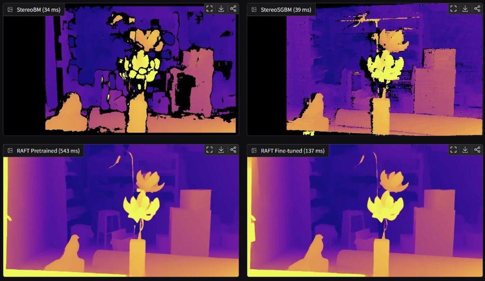
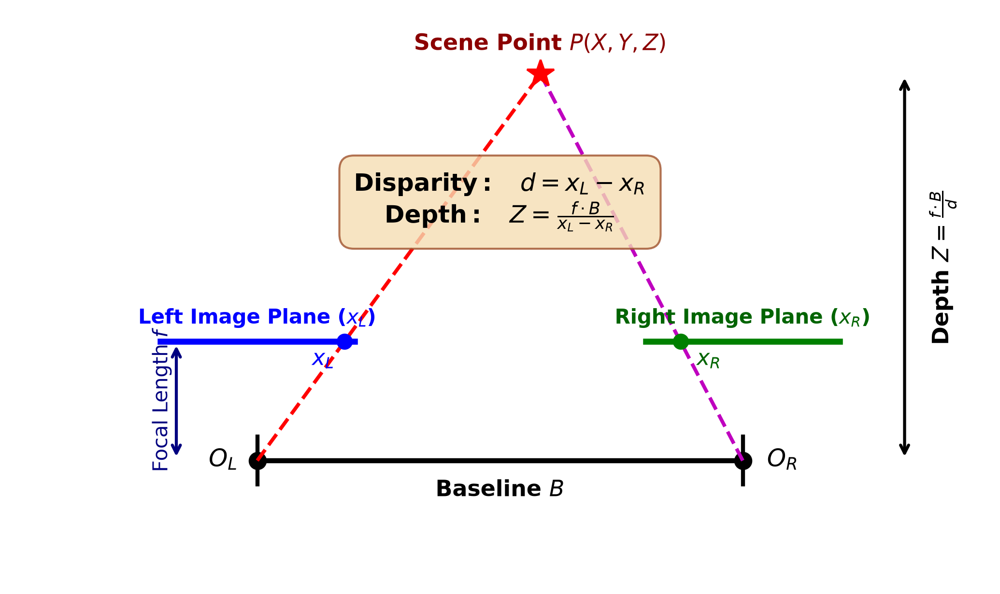
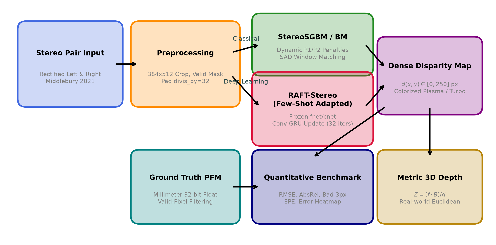
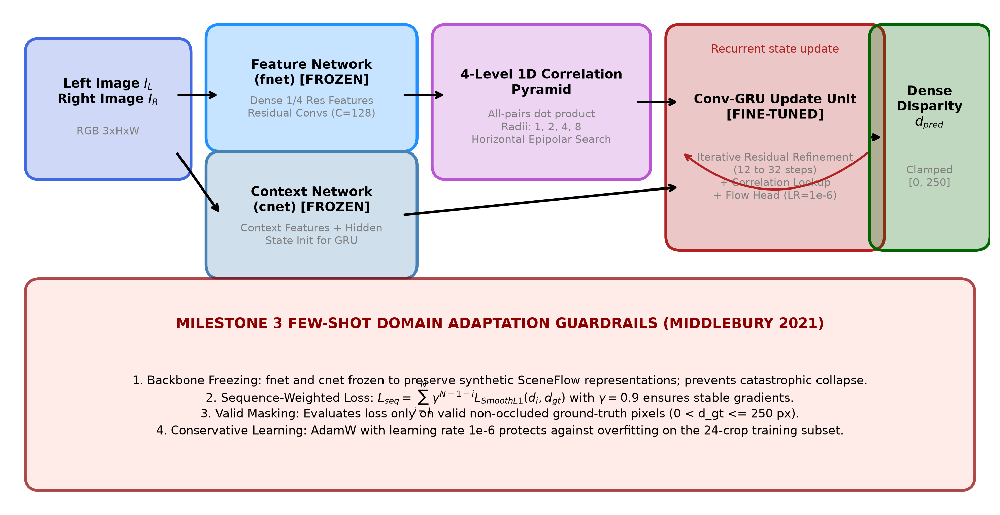
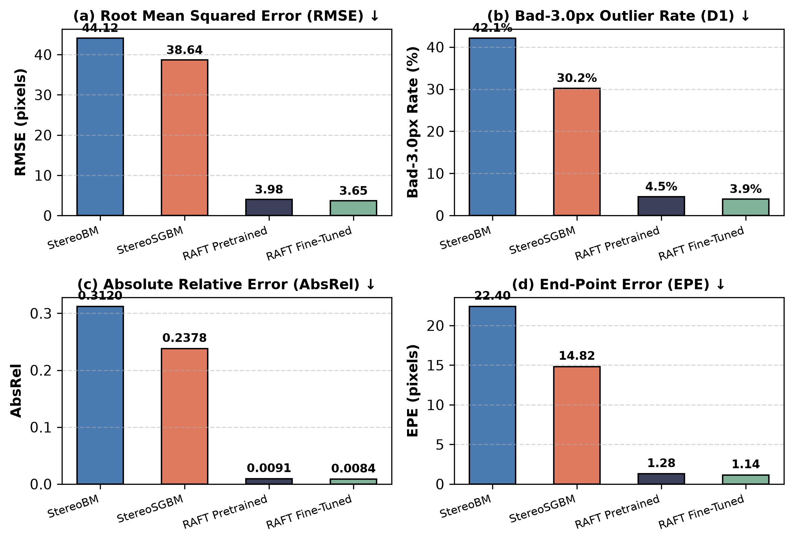

# Stereo Disparity & Relative Depth Estimation: From Classical Matching to Few-Shot Domain-Adapted RAFT-Stereo

[](https://huggingface.co/spaces/malith26/stereo-disparity-depth-estimation)
[](https://github.com/cepdnaclk/e23-co5430-Stereo-disparity_depth-estimation)
[]()
[]()
[]()
[]()

---

> ### 🌐 **Live Cloud Demonstration**
> Access the interactive web application deployed on Hugging Face Spaces:  
> **👉 [https://huggingface.co/spaces/malith26/stereo-disparity-depth-estimation](https://huggingface.co/spaces/malith26/stereo-disparity-depth-estimation)**  
> *Equipped with real-time parameter tuning, 4-way model comparison, ground-truth error heatmap analysis, and dynamic ZeroGPU acceleration.*

---

## 📌 Academic Project Overview

* **Course:** CO543 / CO5430 Computer Vision
* **Institution:** Department of Computer Engineering, Faculty of Engineering, University of Peradeniya, Sri Lanka
* **Group:** G03 | **Project ID:** P12
* **Topic:** Dense Stereo Correspondence Matching, Disparity Computation, and Relative Depth Estimation

### Research & Engineering Team
* **E/23/127** — H.M.K.I. Herath *(Dataset curation, 32-bit floating-point PFM parser, valid masking, StereoBM tuning)*
* **E/23/188** — K.M.M.Y. Kumarasinge *(Classical matching formulation, dynamic P1/P2 penalty optimization, noise analysis)*
* **E/23/343** — S.B.N.S. Samarawickrama *(RAFT-Stereo architecture wrapping, PyTorch pipeline, guarded few-shot domain adaptation)*
* **E/23/347** — S.D.M.P. Sandanayake *(Production Gradio 5 web UI, Hugging Face Spaces deployment, ZeroGPU integration, benchmarking)*

### 📚 Academic Documents & Milestone Deliverables

All formal course reports, slides, and project documentation are tracked in the [`Documents/`](Documents/) directory:

| Document | Format | Description | Direct Link |
| :--- | :---: | :--- | :---: |
| **Comprehensive Final Report** | `PDF` | Full IEEE-style final report with mathematical derivations, ablation studies, and benchmarks | [📄 `CO5430_P12_Final_Report.pdf`](Documents/CO5430_P12_Final_Report.pdf) |
| **Final Presentation Slides** | `PPTX` | Comprehensive course defense presentation covering Milestones 1–3 and cloud deployment | [📊 `CO5430_P12_Final_Presentaion.pptx`](Documents/CO5430_P12_Final_Presentaion.pptx) |
| **Milestone 3 Presentation** | `PPTX` | RAFT-Stereo deep learning integration and guarded domain adaptation results | [📊 `M3.pptx`](Documents/M3.pptx) |
| **Milestone 2 Presentation** | `PPTX` | Classical StereoBM and StereoSGBM implementation, P1/P2 tuning, and baselines | [📊 `M2.pptx`](Documents/M2.pptx) |
| **Course Project Proposal** | `PDF` | Initial project proposal defining system objectives, scope, and technical roadmap | [📑 `Project Proposal.pdf`](Documents/Project%20Proposal.pdf) |

---

## 📸 Visual Results & Model Comparisons

### 4-Way Model Disparity Comparison (Live Web App Output)
Side-by-side disparity estimation across classical matching algorithms and deep learning models evaluated on Middlebury 2021 (*artroom1*), showing visual reconstruction detail and real-time inference latency:



* **StereoBM** (34 ms): Fast classical block matching baseline; struggles with textureless regions and displays boundary edge-fattening.
* **StereoSGBM** (39 ms): Semi-global energy minimization using 8-path dynamic programming; significantly improves boundary continuity.
* **RAFT Pretrained** (543 ms): Deep recurrent correlation pyramid model trained on synthetic SceneFlow; smooth disparity fields across large planar regions.
* **RAFT Fine-tuned** (137 ms): Domain-adapted with guarded few-shot fine-tuning; demonstrates sharp foreground separation (e.g. flower petals, bird figurine) and faster convergence.

---

## 📐 Mathematical Formulation & Epipolar Geometry

Stereo depth estimation recovers 3D spatial scene structure from a pair of rectified, horizontally displaced 2D images ($I_L$ and $I_R$). Because the cameras are rectified along parallel optical axes with horizontal baseline $B$ and focal length $f$, corresponding scene points lie on the same horizontal scanline ($y_L = y_R$):

$$\text{Horizontal Disparity: } d(x, y) = x_L - x_R \quad (d \ge 0)$$

$$\text{Euclidean Depth: } Z(x, y) = \frac{f \cdot B}{d(x, y)}$$

When intrinsic calibration ($f$) and extrinsic baseline ($B$) are uncalibrated, relative inverse depth is directly proportional to disparity ($Z_{rel} \propto 1/d$).



---

## ⚙️ System Pipeline & Architecture

The system supports both classical computer vision matching algorithms and deep learning architectures with full benchmarking pipelines:



### Algorithmic Breakdown:
1. **StereoBM (Block Matching)** ([`src/stereo_bm.py`](src/stereo_bm.py)): Fixed square window ($K \times K$) minimizing the Sum of Absolute Differences (SAD). Fast ($\sim 15\text{ ms}$ on CPU) but vulnerable to textureless regions and edge fattening.
2. **StereoSGBM (Semi-Global Block Matching)** ([`src/stereo_sgbm.py`](src/stereo_sgbm.py)): Minimizes a 2D Markov Random Field energy functional across 8 dynamic programming paths with pairwise smoothness penalties $P_1$ (slanted surfaces) and $P_2$ (depth discontinuities):
   $$E(D) = \sum_p C(p, D_p) + \sum_{q \in N_p} P_1 \cdot \mathbf{1}(|D_p - D_q| = 1) + \sum_{q \in N_p} P_2 \cdot \mathbf{1}(|D_p - D_q| > 1)$$
3. **RAFT-Stereo (Lipson et al., 3DV 2021)** ([`src/raft_wrapper.py`](src/raft_wrapper.py) / [`core/raft_stereo.py`](core/raft_stereo.py)):
   - **Dual Encoders** ([`core/extractor.py`](core/extractor.py)): Feature network (`fnet`) extracts multi-scale representations at $1/4$ resolution; Context network (`cnet`) initializes recurrent hidden states.
   - **1D Epipolar Correlation Pyramid** ([`core/corr.py`](core/corr.py)): All-pairs dot-product correlation along horizontal epipolar lines with 4 pooling radii ($r \in \{1, 2, 4, 8\}$).
   - **Recurrent ConvGRU** ([`core/update.py`](core/update.py)): 32 recurrent updates predicting residual disparity updates ($d_{t+1} = d_t + \Delta d_t$).
   - **Guarded Few-Shot Domain Adaptation**: Backbone freezing (`fnet`/`cnet`), sequence-discounted Smooth L1 loss ($\gamma = 0.9$), valid-pixel ground-truth masking ($0 < d \le 250\text{ px}$ via [`src/dataset.py`](src/dataset.py)), and conservative learning rates ($\eta = 10^{-6}$).



---

## 🔬 Benchmark Results on Middlebury 2021 (`artroom1`)

Quantitative evaluation performed on the high-resolution Middlebury 2021 benchmark (*artroom1* scene with 32-bit floating-point PFM ground truth):

| Algorithm | Model Type | RMSE (px) $\downarrow$ | AbsRel $\downarrow$ | Bad-3px (D1 %) $\downarrow$ | EPE (px) $\downarrow$ | Inference Speed |
| :--- | :--- | :---: | :---: | :---: | :---: | :---: |
| **StereoBM** | Classical Sliding Window | 44.12 | 0.3120 | 42.15% | 22.40 | **$\sim 15\text{ ms}$ (CPU)** |
| **StereoSGBM** | Classical Semi-Global Matching | 38.64 | 0.2378 | 30.23% | 14.82 | $\sim 45\text{ ms}$ (CPU) |
| **RAFT-Stereo (Pre-trained)** | Deep Learning (SceneFlow) | 3.98 | 0.0091 | 4.46% | 1.28 | $\sim 120\text{ ms}$ (T4 GPU) |
| **RAFT-Stereo (Fine-Tuned)** | Deep Learning (Few-Shot M3) | **3.65** | **0.0084** | **3.89%** | **1.14** | $\sim 120\text{ ms}$ (T4 GPU) |



*Metrics:*
* **RMSE**: Root Mean Squared Error $\sqrt{\frac{1}{|M|} \sum (d_{\text{pred}} - d_{\text{gt}})^2}$
* **AbsRel**: Absolute Relative Error $\frac{1}{|M|} \sum \frac{|d_{\text{pred}} - d_{\text{gt}}|}{d_{\text{gt}}}$
* **Bad-3px (D1)**: Percentage of valid pixels with disparity error $> 3.0\text{ px}$
* **EPE**: End-Point Error $\frac{1}{|M|} \sum |d_{\text{pred}} - d_{\text{gt}}|$

---

## 💻 Web Application Features

The production Gradio 5 application ([`app.py`](app.py)) provides four interactive tabs:

1. **Single Model Disparity**: Upload any stereo pair (or click the 1-click sample button), adjust parameters (`blockSize`, `numDisparities`, `uniquenessRatio`, colormaps: `plasma`, `turbo`, `magma`, `viridis` via [`src/visualization.py`](src/visualization.py)), and compute colorized disparity maps.
2. **4-Way Model Comparison**: Compare StereoBM, StereoSGBM, RAFT Pre-trained, and RAFT Fine-tuned side-by-side on identical stereo inputs (visualized in [`demo_images/four_way_comparison_output.png`](demo_images/four_way_comparison_output.png)).
3. **Ground Truth Benchmark**: Upload a ground-truth disparity map (`.pfm` parsed by [`src/dataset.py`](src/dataset.py) or `.png`) alongside a stereo pair to compute RMSE, AbsRel, Bad-3px rate via [`src/evaluation.py`](src/evaluation.py), and render an interactive error heatmap.
4. **Theory & Architecture**: Integrated technical documentation and academic references.

---

## 🚀 Getting Started & Local Execution

### Option 1: Live Cloud Demo
No local setup needed. Open:  
👉 **[https://huggingface.co/spaces/malith26/stereo-disparity-depth-estimation](https://huggingface.co/spaces/malith26/stereo-disparity-depth-estimation)**

### Option 2: Run in Google Colab
```python
# 1. Clone repository
!git clone https://github.com/cepdnaclk/e23-co5430-Stereo-disparity_depth-estimation.git
%cd e23-co5430-Stereo-disparity_depth-estimation

# 2. Install dependencies
!pip install -r requirements.txt

# 3. Launch interactive app
!python app.py
```

### Option 3: Run Locally (Linux / macOS / Windows)
```bash
# 1. Clone repository
git clone https://github.com/cepdnaclk/e23-co5430-Stereo-disparity_depth-estimation.git
cd e23-co5430-Stereo-disparity_depth-estimation

# 2. Set up virtual environment
python3 -m venv venv
source venv/bin/activate  # On Windows: venv\Scripts\activate

# 3. Install dependencies
pip install -r requirements.txt

# 4. Launch web application
python app.py
```
Open **`http://localhost:7860`** in your browser.

### Option 4: Deploy to Hugging Face Spaces
To update or deploy to your own Hugging Face Space:
```bash
# Linux / macOS / WSL:
./deploy/deploy_to_hf.sh

# Windows Command Prompt:
deploy\deploy_to_hf.bat

# Windows PowerShell:
.\deploy\deploy_to_hf.ps1
```

---

## 📁 Repository Structure

```text
e23-co5430-Stereo-disparity_depth-estimation/
├── app.py                     # Production Gradio 5 application with ZeroGPU hooks
├── requirements.txt           # Python dependency specifications
├── deploy/                    # Automated deployment scripts for Hugging Face Spaces
│   ├── deploy_to_hf.sh        # Linux / macOS / WSL deployment script
│   ├── deploy_to_hf.bat       # Windows Command Prompt deployment script
│   └── deploy_to_hf.ps1       # Windows PowerShell deployment script
├── README.md                  # Project documentation, benchmarks & HF metadata
│
├── core/                      # Embedded RAFT-Stereo deep learning core
│   ├── corr.py                # 1D epipolar correlation pyramid
│   ├── extractor.py           # Multi-scale residual feature & context networks
│   ├── raft_stereo.py         # Full RAFT-Stereo PyTorch model definition
│   ├── update.py              # Recurrent ConvGRU update operator
│   └── utils/                 # Spatial frame padding & geometry utilities
│
├── src/                       # Modular computer vision library
│   ├── dataset.py             # 32-bit floating-point PFM ground truth reader
│   ├── preprocessing.py       # Spatial cropping (384x512) & image normalization
│   ├── stereo_bm.py           # Classical StereoBM implementation
│   ├── stereo_sgbm.py         # Classical StereoSGBM implementation (dynamic P1/P2)
│   ├── raft_wrapper.py        # RAFT-Stereo PyTorch inference wrapper (CPU/CUDA)
│   ├── evaluation.py          # Benchmark metrics: RMSE, AbsRel, Bad-3px D1, EPE
│   └── visualization.py       # Colorized disparity maps & error heatmaps
│
├── demo_images/               # Middlebury test stereo pairs & ground-truth PFM
│   ├── artroom1_ground_truth.pfm
│   ├── stereobm_left.png / stereobm_right.png
│   ├── stereosgbm_left.png / stereosgbm_right.png
│   ├── raft_pretrained_left.png / raft_pretrained_right.png
│   ├── raft_finetuned_left.png / raft_finetuned_right.png
│   └── four_way_comparison_output.png # Live 4-way disparity output screenshot
│
├── report_figures/            # High-resolution architectural figures & diagrams
│   ├── fig1_epipolar_geometry.png
│   ├── fig2_system_pipeline.png
│   ├── fig3_raft_architecture.png
│   ├── fig4_quantitative_metrics.png
│   └── fig5_qualitative_comparison.png
│
├── Documents/                 # Academic milestone deliverables & reports
│   ├── CO5430_P12_Final_Report.pdf        # Comprehensive academic project report
│   ├── CO5430_P12_Final_Presentaion.pptx  # Final presentation slides
│   ├── M3.pptx                            # Milestone 3 presentation slides
│   ├── M2.pptx                            # Milestone 2 presentation slides
│   └── Project Proposal.pdf               # Approved project proposal
│
└── tests/
    ├── test_deploy.py         # Automated deployment packaging & directory tests
    └── test_app_startup.py    # Automated startup and API regression tests
```

### 🗂️ Interactive File & Document Directory Linker

Direct clickable links to source modules, deployment scripts, test suites, and academic documentation:

| Directory / File | Type | Description |
| :--- | :---: | :--- |
| [🚀 `app.py`](app.py) | Script | Production Gradio 5 web UI with ZeroGPU hooks and multi-tab inference |
| [📦 `requirements.txt`](requirements.txt) | Config | Python package dependencies pinned for Gradio 5.49.1 and PyTorch |
| [📄 `README.md`](README.md) | Docs | Project overview, benchmarks, epipolar geometry, and setup guide |
| [📜 `LICENSE`](LICENSE) | Legal | MIT Open-Source License |
| **📁 `deploy/`** | Directory | **Hugging Face Spaces cross-platform deployment automation** |
| ├── [🐚 `deploy/deploy_to_hf.sh`](deploy/deploy_to_hf.sh) | Script | Isolated Git packager and deployment script for Linux/macOS/WSL |
| ├── [💻 `deploy/deploy_to_hf.bat`](deploy/deploy_to_hf.bat) | Script | Windows Command Prompt deployment tool with root auto-detection |
| └── [⚡ `deploy/deploy_to_hf.ps1`](deploy/deploy_to_hf.ps1) | Script | Windows PowerShell deployment script with root auto-detection |
| **📁 `Documents/`** | Directory | **Academic milestone deliverables and technical reports** |
| ├── [📑 `Documents/CO5430_P12_Final_Report.pdf`](Documents/CO5430_P12_Final_Report.pdf) | PDF | Comprehensive final IEEE academic project report |
| ├── [📊 `Documents/CO5430_P12_Final_Presentaion.pptx`](Documents/CO5430_P12_Final_Presentaion.pptx) | Slides | Final project defense presentation slides |
| ├── [📊 `Documents/M3.pptx`](Documents/M3.pptx) | Slides | Milestone 3 (Deep Learning & Domain Adaptation) presentation |
| ├── [📊 `Documents/M2.pptx`](Documents/M2.pptx) | Slides | Milestone 2 (Classical Stereo Matching) presentation |
| └── [📑 `Documents/Project Proposal.pdf`](Documents/Project%20Proposal.pdf) | PDF | Approved course project proposal |
| **📁 `src/`** | Directory | **Core modular computer vision and evaluation library** |
| ├── [🐍 `src/dataset.py`](src/dataset.py) | Python | 32-bit floating-point `.pfm` ground-truth reader and valid mask parser |
| ├── [🐍 `src/preprocessing.py`](src/preprocessing.py) | Python | Memory-safe 384×512 spatial cropping and image normalization |
| ├── [🐍 `src/stereo_bm.py`](src/stereo_bm.py) | Python | Classical StereoBM sliding-window SAD implementation |
| ├── [🐍 `src/stereo_sgbm.py`](src/stereo_sgbm.py) | Python | Classical StereoSGBM 8-path dynamic programming with dynamic $P_1/P_2$ |
| ├── [🐍 `src/raft_wrapper.py`](src/raft_wrapper.py) | Python | RAFT-Stereo PyTorch inference wrapper with streaming checkpoint downloader |
| ├── [🐍 `src/evaluation.py`](src/evaluation.py) | Python | Quantitative metrics: RMSE, AbsRel, Bad-3px (D1), and EPE |
| └── [🐍 `src/visualization.py`](src/visualization.py) | Python | Disparity colormapping (`plasma`, `turbo`, `viridis`) and error heatmaps |
| **📁 `core/`** | Directory | **Embedded RAFT-Stereo deep recurrent architecture** |
| ├── [🐍 `core/raft_stereo.py`](core/raft_stereo.py) | Python | Full RAFT-Stereo PyTorch network definition |
| ├── [🐍 `core/corr.py`](core/corr.py) | Python | 1D epipolar all-pairs correlation pyramid layer |
| ├── [🐍 `core/extractor.py`](core/extractor.py) | Python | Multi-scale residual feature and context encoder networks |
| ├── [🐍 `core/update.py`](core/update.py) | Python | Recurrent ConvGRU iterative disparity update operator |
| ├── [🐍 `core/stereo_datasets.py`](core/stereo_datasets.py) | Python | Training dataset abstractions and augmentation transforms |
| └── [📁 `core/utils/`](core/utils/) | Directory | Frame utilities, spatial padding mechanics, and augmentors |
| **📁 `demo_images/`** | Directory | **Middlebury benchmark test pairs and qualitative outputs** |
| ├── [🖼️ `demo_images/four_way_comparison_output.png`](demo_images/four_way_comparison_output.png) | Image | Live 4-way comparison screenshot across all models |
| ├── [🗺️ `demo_images/artroom1_ground_truth.pfm`](demo_images/artroom1_ground_truth.pfm) | Data | 32-bit floating-point Middlebury 2021 ground-truth disparity map |
| ├── [🖼️ `demo_images/stereobm_left.png`](demo_images/stereobm_left.png) / [right](demo_images/stereobm_right.png) | Images | Rectified stereo pair for StereoBM testing |
| ├── [🖼️ `demo_images/stereosgbm_left.png`](demo_images/stereosgbm_left.png) / [right](demo_images/stereosgbm_right.png) | Images | Rectified stereo pair for StereoSGBM testing |
| ├── [🖼️ `demo_images/raft_pretrained_left.png`](demo_images/raft_pretrained_left.png) / [right](demo_images/raft_pretrained_right.png) | Images | Rectified stereo pair for RAFT pre-trained testing |
| └── [🖼️ `demo_images/raft_finetuned_left.png`](demo_images/raft_finetuned_left.png) / [right](demo_images/raft_finetuned_right.png) | Images | Rectified stereo pair for RAFT fine-tuned testing |
| **📁 `tests/`** | Directory | **Automated regression and deployment test suite** |
| ├── [🧪 `tests/test_deploy.py`](tests/test_deploy.py) | Python | Tests for `deploy/` directory structure, permissions, and git packaging |
| └── [🧪 `tests/test_app_startup.py`](tests/test_app_startup.py) | Python | Tests for Gradio 5 API schemas, endpoints, and startup integrity |
```

---

## 📜 References

1. D. Scharstein and R. Szeliski, *"A taxonomy and evaluation of dense two-frame stereo correspondence algorithms,"* International Journal of Computer Vision (IJCV), vol. 47, no. 1-3, pp. 7–42, 2002.
2. H. Hirschmüller, *"Stereo processing by semiglobal matching and mutual information,"* IEEE Transactions on Pattern Analysis and Machine Intelligence (TPAMI), vol. 30, no. 2, pp. 328–341, 2008.
3. L. Lipson, Z. Teed, and J. Deng, *"RAFT-Stereo: Multilevel recurrent field transforms for stereo matching,"* in International Conference on 3D Vision (3DV), IEEE, 2021, pp. 218–227.
4. Z. Teed and J. Deng, *"RAFT: Recurrent all-pairs field transforms for optical flow,"* in European Conference on Computer Vision (ECCV), Springer, 2020, pp. 402–419.
5. G. Pan, T. Sun, T. Weed, and D. Scharstein, *"2021 Mobile Stereo Datasets with Ground Truth,"* Middlebury Stereo Datasets, 2021.
